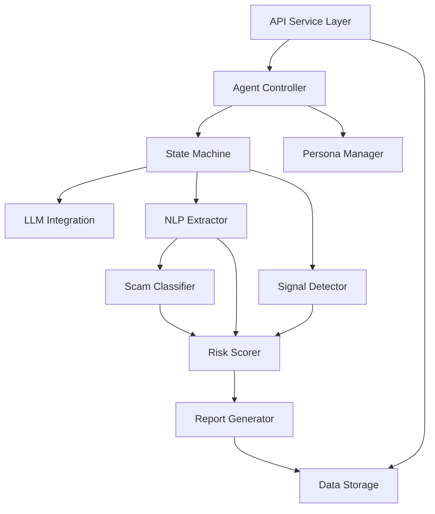

# Design Document: Scam Intelligence System

## Overview

The Scam Intelligence System is an AI-powered honeypot that autonomously engages with scammers to extract structured intelligence. The system uses a state machine to manage conversation flow, simulates vulnerable personas to encourage scammer engagement, and employs NLP techniques to extract entities, detect scam signals, classify scam types, and generate risk scores. The architecture follows an API-first design with clear separation between conversation management, intelligence extraction, and reporting layers.

## Architecture

The system follows a layered architecture with the following components:



### Layer Responsibilities

**API Service Layer**: Handles HTTP requests, authentication, rate limiting, and response formatting. Exposes REST endpoints for conversation management and report retrieval.

**Conversation Management Layer**: Manages conversation lifecycle through the Agent Controller and State Machine. Coordinates persona selection, response generation, and state transitions.

**Intelligence Extraction Layer**: Processes conversation content through NLP Extractor, Signal Detector, and Scam Classifier to identify and structure scam intelligence.

**Analysis Layer**: Calculates risk scores based on extracted entities, detected signals, and scam classifications.

**Reporting Layer**: Generates structured JSON reports and manages data persistence.

## Components and Interfaces

### 1. API Service

**Responsibilities**: 
- Expose REST endpoints for system interaction
- Handle authentication and authorization
- Implement rate limiting
- Format responses and handle errors

**Endpoints**:
```
POST   /api/v1/conversations              - Initiate new conversation
GET    /api/v1/conversations/:id          - Get conversation status
GET    /api/v1/conversations/:id/report   - Get intelligence report
GET    /api/v1/conversations               - List conversations (paginated)
DELETE /api/v1/conversations/:id          - Terminate conversation
GET    /api/v1/health                      - Health check
GET    /api/v1/metrics                     - System metrics
```

**Interface**:
```typescript
interface APIService {
  initiateConversation(request: ConversationRequest): ConversationResponse
  getConversationStatus(conversationId: string): ConversationStatus
  getIntelligenceReport(conversationId: string): IntelligenceReport
  listConversations(page: number, pageSize: number): ConversationList
  terminateConversation(conversationId: string): TerminationResponse
  getHealth(): HealthStatus
  getMetrics(): SystemMetrics
}

interface ConversationRequest {
  initialMessage: string
  context?: Record<string, any>
}

interface ConversationResponse {
  conversationId: string
  status: string
  message: string
}
```

### 2. Agent Controller

**Responsibilities**:
- Manage conversation lifecycle
- Coordinate between State Machine, Persona Manager, and LLM
- Handle concurrent conversations
- Track conversation metadata

**Interface**:
```typescript
interface AgentController {
  createConversation(initialMessage: string): Conversation
  processMessage(conversationId: string, message: string): Response
  getConversation(conversationId: string): Conversation
  terminateConversation(conversationId: string): void
  listActiveConversations(): Conversation[]
}

interface Conversation {
  id: string
  state: ConversationState
  persona: Persona
  messages: Message[]
  extractedEntities: Entity[]
  scamSignals: ScamSignal[]
  classification: ScamClassification
  riskScore: number
  createdAt: Date
  updatedAt: Date
}
```

### 3. State Machine

**Responsibilities**:
- Manage conversation state transitions
- Enforce state transition rules
- Determine appropriate actions for each state
- Track state history

**States**:
- `idle`: No active conversation
- `initial_contact`: First interaction with potential scammer
- `engagement`: Building rapport and encouraging disclosure
- `information_gathering`: Actively prompting for entity disclosure
- `extraction`: Focused extraction of specific entities
- `termination`: Conversation conclusion

**Interface**:
```typescript
interface StateMachine {
  getCurrentState(conversationId: string): ConversationState
  transition(conversationId: string, event: StateEvent): ConversationState
  getValidTransitions(currentState: ConversationState): ConversationState[]
  getStateHistory(conversationId: string): StateTransition[]
}

enum ConversationState {
  IDLE = "idle",
  INITIAL_CONTACT = "initial_contact",
  ENGAGEMENT = "engagement",
  INFORMATION_GATHERING = "information_gathering",
  EXTRACTION = "extraction",
  TERMINATION = "termination"
}

interface StateTransition {
  fromState: ConversationState
  toState: ConversationState
  timestamp: Date
  reason: string
}
```

### 4. Persona Manager

**Responsibilities**:
- Maintain library of persona profiles
- Select appropriate persona for conversations
- Generate persona-consistent responses
- Track persona usage statistics

**Interface**:
```typescript
interface PersonaManager {
  getPersona(personaId: string): Persona
  selectPersona(context: ConversationContext): Persona
  listPersonas(): Persona[]
  generateResponse(persona: Persona, context: string, intent: string): string
}

interface Persona {
  id: string
  name: string
  age: number
  background: string
  vulnerabilityLevel: number  // 1-10
  communicationStyle: string
  typicalResponses: string[]
  characteristics: Record<string, any>
}
```

### 5. NLP Extractor

**Responsibilities**:
- Extract entities from conversation text
- Validate entity formats
- Provide confidence scores for extractions
- Handle multiple entity instances

**Interface**:
```typescript
interface NLPExtractor {
  extractEntities(text: string): Entity[]
  extractPhoneNumbers(text: string): PhoneNumber[]
  extractPaymentIds(text: string): PaymentId[]
  extractUrls(text: string): URL[]
  extractOrganizations(text: string): Organization[]
  extractBankAccounts(text: string): BankAccount[]
  extractEmails(text: string): Email[]
}

interface Entity {
  type: EntityType
  value: string
  confidence: number
  context: string
  timestamp: Date
  metadata: Record<string, any>
}

enum EntityType {
  PHONE_NUMBER = "phone_number",
  PAYMENT_ID = "payment_id",
  URL = "url",
  ORGANIZATION = "organization",
  BANK_ACCOUNT = "bank_account",
  EMAIL = "email"
}
```

### 6. Signal Detector

**Responsibilities**:
- Detect scam signals in conversation text
- Calculate confidence scores for signals
- Categorize signal types
- Track signal patterns

**Interface**:
```typescript
interface SignalDetector {
  detectSignals(text: string): ScamSignal[]
  detectUrgency(text: string): ScamSignal | null
  detectFinancialRequest(text: string): ScamSignal | null
  detectImpersonation(text: string): ScamSignal | null
  detectThreats(text: string): ScamSignal | null
}

interface ScamSignal {
  type: SignalType
  confidence: number
  text: string
  context: string
  timestamp: Date
}

enum SignalType {
  URGENCY = "urgency",
  FINANCIAL_REQUEST = "financial_request",
  IMPERSONATION = "impersonation",
  THREAT = "threat",
  AUTHORITY_CLAIM = "authority_claim"
}
```

### 7. Scam Classifier

**Responsibilities**:
- Classify scam types based on conversation content
- Assign confidence scores to classifications
- Support multi-label classification
- Update classifications as conversations progress

**Interface**:
```typescript
interface ScamClassifier {
  classify(conversation: Conversation): ScamClassification
  updateClassification(conversationId: string, newData: string): ScamClassification
}

interface ScamClassification {
  primaryType: ScamType
  primaryConfidence: number
  secondaryTypes: Array<{type: ScamType, confidence: number}>
  updatedAt: Date
}

enum ScamType {
  PHISHING = "phishing",
  ROMANCE = "romance",
  INVESTMENT = "investment",
  TECH_SUPPORT = "tech_support",
  IMPERSONATION = "impersonation",
  ADVANCE_FEE = "advance_fee",
  LOTTERY = "lottery"
}
```

### 8. Risk Scorer

**Responsibilities**:
- Calculate risk scores (0-100)
- Provide score breakdowns
- Update scores in real-time
- Apply scoring rules and thresholds

**Interface**:
```typescript
interface RiskScorer {
  calculateScore(conversation: Conversation): RiskScore
  updateScore(conversationId: string): RiskScore
  getScoreBreakdown(conversationId: string): ScoreBreakdown
}

interface RiskScore {
  score: number  // 0-100
  breakdown: ScoreBreakdown
  calculatedAt: Date
}

interface ScoreBreakdown {
  signalScore: number
  entityScore: number
  classificationScore: number
  urgencyScore: number
  financialScore: number
}
```

### 9. Report Generator

**Responsibilities**:
- Generate structured JSON intelligence reports
- Validate reports against schema
- Include all extracted intelligence
- Format conversation transcripts

**Interface**:
```typescript
interface ReportGenerator {
  generateReport(conversationId: string): IntelligenceReport
  validateReport(report: IntelligenceReport): boolean
  exportReport(conversationId: string, format: string): string
}

interface IntelligenceReport {
  conversationId: string
  timestamp: Date
  persona: {
    id: string
    name: string
  }
  scamClassification: ScamClassification
  riskScore: RiskScore
  extractedEntities: Entity[]
  scamSignals: ScamSignal[]
  conversationMetadata: {
    duration: number
    messageCount: number
    stateTransitions: StateTransition[]
  }
  transcript: Message[]
}

interface Message {
  id: string
  sender: "system" | "scammer"
  content: string
  timestamp: Date
}
```

## Data Models

### Core Data Structures

**Conversation**:
```typescript
{
  id: string
  state: ConversationState
  persona: Persona
  messages: Message[]
  extractedEntities: Entity[]
  scamSignals: ScamSignal[]
  classification: ScamClassification
  riskScore: number
  createdAt: Date
  updatedAt: Date
  metadata: {
    initialMessage: string
    messageCount: number
    duration: number
    stateHistory: StateTransition[]
  }
}
```

**Entity**:
```typescript
{
  type: EntityType
  value: string
  confidence: number
  context: string
  timestamp: Date
  metadata: {
    format: string
    validated: boolean
    countryCode?: string  // for phone numbers
    domain?: string       // for URLs
    paymentSystem?: string // for payment IDs
  }
}
```

**Persona**:
```typescript
{
  id: string
  name: string
  age: number
  background: string
  vulnerabilityLevel: number
  communicationStyle: string
  typicalResponses: string[]
  characteristics: {
    techSavvy: number
    trustLevel: number
    financialAwareness: number
    responseSpeed: number
  }
}
```

### Database Schema

The system uses a document-based storage model with the following collections:

**conversations**: Stores active and completed conversations
**personas**: Stores persona profiles
**reports**: Stores generated intelligence reports
**metrics**: Stores system metrics and statistics

## Correctness Properties

*A property is a characteristic or behavior that should hold true across all valid executions of a system—essentially, a formal statement about what the system should do. Properties serve as the bridge between human-readable specifications and machine-verifiable correctness guarantees.*


### Property Reflection

After analyzing all acceptance criteria, I've identified the following areas where properties can be consolidated:

**Entity Extraction (3.1-3.8)**: Properties 3.1-3.6 all test extraction of specific entity types. These can be consolidated into a single comprehensive property that tests extraction works for all entity types. Property 3.7 (multiple instances) and 3.8 (validation) are distinct and should remain separate.

**Signal Detection (4.1-4.4)**: Properties 4.1-4.4 all test detection of different signal types. These can be consolidated into a single property that tests signal detection works for all signal types.

**State Machine (9.2, 9.4)**: Property 9.2 (initial state) is a specific example. Property 9.4 (recording transitions) applies to all transitions. These are distinct enough to keep separate.

**Logging (10.1, 10.2)**: Both test logging completeness but for different event types (normal events vs errors). These should remain separate as they test different code paths.

### Correctness Properties

**Property 1: Persona Consistency**
*For any* conversation and selected persona, all generated responses in that conversation should reflect the persona's characteristics (vulnerability level, communication style, background) consistently throughout the conversation.
**Validates: Requirements 1.3, 1.4**

**Property 2: Persona Selection Appropriateness**
*For any* scam context provided to the Agent Controller, a persona should be selected and the persona's characteristics should be appropriate for engaging with that scam type.
**Validates: Requirements 1.2**

**Property 3: Response Timing Realism**
*For any* persona response, the response delay should fall within realistic human timing ranges based on message length and persona characteristics (e.g., tech-savvy personas respond faster).
**Validates: Requirements 1.5**

**Property 4: Automatic Engagement Initiation**
*For any* detected scam conversation, the Agent Controller should automatically initiate engagement without requiring manual intervention.
**Validates: Requirements 2.1**

**Property 5: Valid State Transitions**
*For any* conversation state transition, the transition should only use states from the defined set (idle, initial_contact, engagement, information_gathering, extraction, termination) and should follow valid transition rules.
**Validates: Requirements 2.2, 9.1, 9.3**

**Property 6: Autonomous Response Generation**
*For any* conversation state, the system should generate contextually appropriate responses without requiring human input or external intervention.
**Validates: Requirements 2.3**

**Property 7: Conversation Termination**
*For any* conversation that reaches a natural conclusion or extraction goal, the State Machine should transition to the termination state.
**Validates: Requirements 2.4, 9.6**

**Property 8: Conversation Isolation**
*For any* set of concurrent conversations, actions performed in one conversation (state changes, entity extraction, scoring) should not affect the state or data of other conversations.
**Validates: Requirements 2.5**

**Property 9: Unproductive Conversation Termination**
*For any* conversation that becomes unproductive (no new entities extracted, repetitive responses, or lack of scam signals), the system should terminate it within 10 message exchanges.
**Validates: Requirements 2.6**

**Property 10: Entity Extraction Completeness**
*For any* conversation text containing entities (phone numbers, payment IDs, URLs, organizations, bank accounts, emails), the NLP Extractor should identify and extract all instances of each entity type with proper formatting and metadata.
**Validates: Requirements 3.1, 3.2, 3.3, 3.4, 3.5, 3.6, 3.7**

**Property 11: Entity Validation**
*For any* extracted entity, the system should validate it against known format patterns and flag malformed entries with appropriate validation status.
**Validates: Requirements 3.8**

**Property 12: Scam Signal Detection**
*For any* conversation text containing scam indicators (urgency language, financial requests, impersonation, threats), the Signal Detector should flag them as scam signals with appropriate confidence scores.
**Validates: Requirements 4.1, 4.2, 4.3, 4.4, 4.5**

**Property 13: Signal Aggregation**
*For any* conversation with multiple detected scam signals, the system should aggregate all signals for use in risk scoring, maintaining individual signal details and confidence scores.
**Validates: Requirements 4.6**

**Property 14: Scam Classification Assignment**
*For any* conversation content analyzed, the Scam Classifier should assign a primary scam type with confidence score, and if characteristics of multiple types are present, should assign secondary classifications.
**Validates: Requirements 5.2, 5.3**

**Property 15: Classification Updates**
*For any* conversation where new information emerges, the Scam Classifier should update the classification to reflect the new information, potentially changing primary or secondary types.
**Validates: Requirements 5.4**

**Property 16: Risk Score Bounds**
*For any* conversation, the calculated risk score should be between 0 and 100 inclusive.
**Validates: Requirements 6.1**

**Property 17: Risk Score Factors**
*For any* conversation, changing any of the risk factors (number of scam signals, entity types extracted, scam classification, urgency indicators, financial request amounts) should affect the calculated risk score.
**Validates: Requirements 6.2**

**Property 18: High-Value Financial Threshold**
*For any* conversation involving financial transactions above $1000, the risk score should be at least 70.
**Validates: Requirements 6.3**

**Property 19: Signal Proportionality**
*For any* two conversations where one has more high-confidence scam signals than the other (all else being equal), the conversation with more signals should have a higher risk score.
**Validates: Requirements 6.4**

**Property 20: Real-Time Score Updates**
*For any* conversation in progress, adding a new message should trigger a risk score recalculation, and the updated score should reflect any new signals or entities in the message.
**Validates: Requirements 6.5**

**Property 21: Score Breakdown Completeness**
*For any* calculated risk score, the system should provide a breakdown containing all score components (signal score, entity score, classification score, urgency score, financial score).
**Validates: Requirements 6.6**

**Property 22: Report Completeness**
*For any* generated intelligence report, it should contain all required fields: conversation_id, timestamp, persona_used, scam_classification, risk_score, extracted_entities, scam_signals, and conversation_transcript.
**Validates: Requirements 7.1, 7.5**

**Property 23: Report Schema Validation**
*For any* generated report, it should pass validation against the defined JSON schema before being output or stored.
**Validates: Requirements 7.3**

**Property 24: Entity Structuring in Reports**
*For any* report containing extracted entities, each entity should be structured by type and include metadata fields: confidence, context, and timestamp.
**Validates: Requirements 7.4**

**Property 25: API Authentication**
*For any* API request received, the system should authenticate it using the provided API key, rejecting requests with invalid or missing keys with 401 status.
**Validates: Requirements 8.2**

**Property 26: Report Retrieval**
*For any* valid report retrieval request with an existing conversation_id, the API should return the complete structured JSON report for that conversation.
**Validates: Requirements 8.4**

**Property 27: HTTP Status Code Correctness**
*For any* API request, the response should include an appropriate HTTP status code: 200 for success, 400 for bad requests, 401 for authentication failures, 404 for not found, 500 for server errors.
**Validates: Requirements 8.5**

**Property 28: Pagination Correctness**
*For any* list endpoint request with pagination parameters (page number, page size), the response should return the correct subset of results and include pagination metadata (total count, current page, total pages).
**Validates: Requirements 8.6**

**Property 29: Rate Limiting Enforcement**
*For any* API key, if more than 100 requests are made within a 60-second window, subsequent requests should be rejected with 429 status until the window resets.
**Validates: Requirements 8.7**

**Property 30: API Request Logging**
*For any* API request received, the system should create a log entry containing the timestamp, client identifier (API key), endpoint, and request outcome.
**Validates: Requirements 8.8**

**Property 31: Initial State Correctness**
*For any* newly initiated conversation, the State Machine should begin in the initial_contact state.
**Validates: Requirements 9.2**

**Property 32: State Transition Recording**
*For any* state transition that occurs, the system should record it with a timestamp, from-state, to-state, and reason in the conversation's state history.
**Validates: Requirements 9.4**

**Property 33: Information Gathering Prompts**
*For any* conversation in the information_gathering state, the system should generate responses that actively prompt for entity disclosure (e.g., asking for contact information, payment details).
**Validates: Requirements 9.5**

**Property 34: State Persistence and Recovery**
*For any* conversation, if the system restarts, the conversation state should be recoverable from persistent storage with all state history, entities, and metadata intact.
**Validates: Requirements 9.7**

**Property 35: Event Logging Completeness**
*For any* conversation event (message sent, state transition, entity extracted, signal detected), the system should create a log entry with timestamp, conversation_id, and event type.
**Validates: Requirements 10.1**

**Property 36: Error Logging Detail**
*For any* error that occurs, the system should log error details including error type, stack trace, context (conversation_id, component), and timestamp.
**Validates: Requirements 10.2**

**Property 37: Resource Warning Logging**
*For any* system resource (CPU, memory, disk) that exceeds 80% capacity, the system should log a warning with the resource type, current usage, and timestamp.
**Validates: Requirements 10.5**

## Error Handling

### Error Categories

**Validation Errors**:
- Invalid API requests (missing required fields, malformed data)
- Invalid entity formats
- Invalid state transitions
- Schema validation failures

**Processing Errors**:
- LLM API failures or timeouts
- NLP extraction failures
- Classification failures
- Scoring calculation errors

**System Errors**:
- Database connection failures
- Storage failures
- Out of memory conditions
- Network failures

### Error Handling Strategy

**API Layer**:
- Validate all inputs before processing
- Return appropriate HTTP status codes with error details
- Log all errors with request context
- Implement retry logic for transient failures

**Conversation Management**:
- Gracefully handle LLM failures by using fallback responses
- Persist conversation state before risky operations
- Implement timeout mechanisms for long-running operations
- Provide clear error messages in conversation metadata

**Data Processing**:
- Continue processing even if individual entity extraction fails
- Assign confidence scores to reflect extraction uncertainty
- Log extraction failures for debugging
- Provide partial results when complete processing fails

**Storage Layer**:
- Implement retry logic with exponential backoff
- Cache critical data in memory
- Provide degraded functionality if storage is unavailable
- Alert operators on persistent storage failures

### Error Recovery

**Conversation Recovery**:
- Persist conversation state after each message
- Support resuming conversations from last known state
- Maintain conversation history for debugging
- Provide manual intervention endpoints for stuck conversations

**System Recovery**:
- Implement health checks for all components
- Support graceful shutdown and startup
- Recover in-progress conversations on restart
- Maintain audit logs for post-incident analysis

## Testing Strategy

### Dual Testing Approach

The system requires both unit testing and property-based testing for comprehensive coverage:

**Unit Tests**: Focus on specific examples, edge cases, and error conditions. Unit tests validate concrete scenarios and integration points between components.

**Property Tests**: Verify universal properties across all inputs through randomized testing. Property tests ensure correctness holds for the wide range of inputs the system will encounter in production.

Both approaches are complementary and necessary. Unit tests catch specific bugs and validate known edge cases, while property tests verify general correctness and discover unexpected edge cases through randomization.

### Property-Based Testing Configuration

**Testing Library**: Use `fast-check` (for TypeScript/JavaScript) or `hypothesis` (for Python) for property-based testing.

**Test Configuration**:
- Minimum 100 iterations per property test (due to randomization)
- Each property test must reference its design document property
- Tag format: `Feature: scam-intelligence-system, Property {number}: {property_text}`

**Example Property Test Structure**:
```typescript
// Feature: scam-intelligence-system, Property 10: Entity Extraction Completeness
test('extracted entities include all instances with proper formatting', () => {
  fc.assert(
    fc.property(
      fc.conversationWithEntities(), // custom generator
      (conversation) => {
        const extracted = nlpExtractor.extractEntities(conversation.text);
        const expected = conversation.expectedEntities;
        
        // Verify all expected entities were extracted
        expect(extracted.length).toBeGreaterThanOrEqual(expected.length);
        
        // Verify each entity has proper formatting
        extracted.forEach(entity => {
          expect(entity).toHaveProperty('type');
          expect(entity).toHaveProperty('value');
          expect(entity).toHaveProperty('confidence');
          expect(entity).toHaveProperty('metadata');
        });
      }
    ),
    { numRuns: 100 }
  );
});
```

### Unit Testing Strategy

**Component-Level Tests**:
- Test each component interface independently
- Mock dependencies to isolate component behavior
- Test error conditions and edge cases
- Validate input/output contracts

**Integration Tests**:
- Test component interactions
- Validate end-to-end conversation flows
- Test API endpoints with real requests
- Verify database operations

**Edge Cases to Test**:
- Empty or null inputs
- Extremely long messages
- Special characters and encoding issues
- Concurrent conversation handling
- System restart scenarios
- Rate limiting boundaries
- Invalid state transitions

### Test Coverage Goals

- Unit test coverage: >80% for all components
- Property test coverage: All 37 correctness properties implemented
- Integration test coverage: All API endpoints and major workflows
- Error handling coverage: All error categories tested

### Continuous Testing

- Run unit tests on every commit
- Run property tests in CI/CD pipeline
- Monitor test execution time and flakiness
- Maintain test data generators for realistic scenarios
- Review and update tests as requirements evolve
